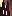
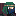
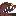
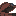
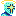
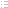
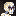
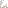
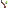

# ⛏️ PITBOUND

**a turn-based tactical roguelike — somewhere between *Slice & Dice* and *Made in Abyss***  
powered entirely by web technologies (React · TypeScript · Pixi.js · Tailwind)

---

## 📖 Overview

Descend into an ever-shifting abyss. Navigate a procedurally generated vertical shaft — left and right paths branch at each depth. Choose your encounters: **battles** against monstrous creatures, **treasure** chambers (with the occasional mimic), or **rest** to recover your party.

Your fighters are built from modular **bricks** — body parts like hearts, claws, bones, brains, and eyes. Each brick has its own health and grants unique abilities. In combat, enemy bricks can be destroyed individually, crippling their capabilities. Manage your inventory, equip items, and survive as deep as you can go.

### World Events

| | |
|---|---|
|  | **Battle** — face off against hostile fighters |
|  | **Treasure** — find loot and equipment |
|  | **Empty** — a quiet spot on the descent |
|  | **Party** — rest and reorganise |

---

## 🎨 Art & Abilities

### Fighters

Characters and enemies are small pixel-art sprites (12–16 px):

 Pitling &nbsp;&nbsp;
 Skull &nbsp;&nbsp;
 Collector &nbsp;&nbsp;
 Mimic &nbsp;&nbsp;
 Chest &nbsp;&nbsp;
 Training Dummy &nbsp;&nbsp;
 Dev

### Bricks (Body Parts)

Your fighter is assembled from bricks — each with their own health and abilities:

 Heart &nbsp;
 Bone &nbsp;
 Claw &nbsp;
 Brain &nbsp;
 Eye &nbsp;
 Flesh &nbsp;
 Hand &nbsp;
 Attack &nbsp;
 Bag &nbsp;
 Spike &nbsp;
 Crit &nbsp;
 Run

### Abilities

Bricks grant abilities for use in and out of combat:

 Scratch &nbsp;
 Slash &nbsp;
 Hit &nbsp;
 Kill &nbsp;
 Heal &nbsp;
 Move &nbsp;
 Backstab &nbsp;
 Cleave &nbsp;
 Explosion &nbsp;
 Pierce &nbsp;
 Flee &nbsp;
 Up &nbsp;
 Down

### Items

Equipment that can be slotted into brick inventories:

 Sword &nbsp;
 Dagger &nbsp;
 Stick &nbsp;
 Windboot

---

## 🧱 Tech Stack

| | |
|---|---|
| **Framework** | [React 18](https://react.dev) + [TypeScript](https://www.typescriptlang.org) |
| **Bundler** | [Vite 5](https://vitejs.dev) |
| **Rendering** | [Pixi.js 8](https://pixijs.com) (WebGL + GLSL shaders) |
| **Styling** | [Tailwind CSS](https://tailwindcss.com) + [Framer Motion](https://www.framer.com/motion) |
| **Audio** | [Howler.js](https://howlerjs.com) |
| **Persistence** | [Dexie.js](https://dexie.org) (IndexedDB) |
| **Components** | [shadcn/ui](https://ui.shadcn.com) + [Storybook](https://storybook.js.org) |

---

## 🚦 Status

> **This project is currently not being actively developed.**  
> The last commit was July 2024. The codebase represents an early, playable prototype — feel free to explore, fork, or draw inspiration from it.

---

## ⚖️ Legalities

Although open-source, all pixel-art assets in this repository are protected under copyright.
